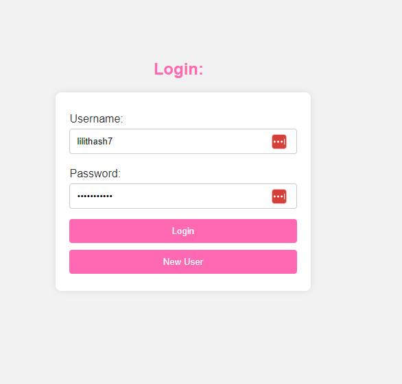
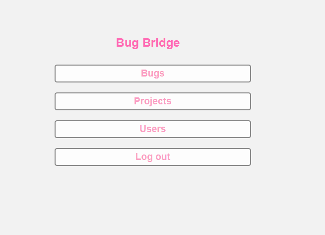
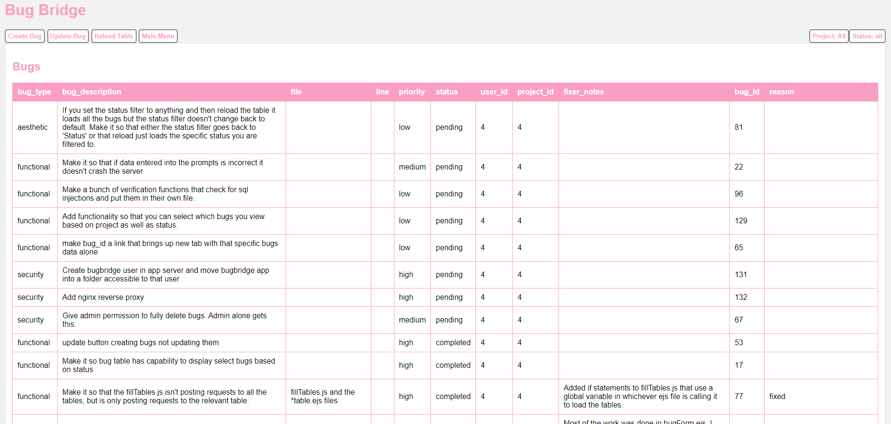
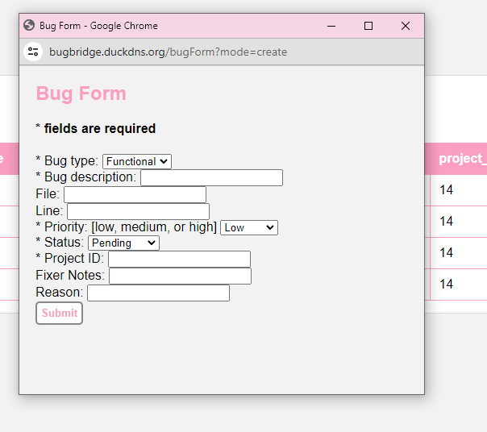

<!-- Improved compatibility of back to top link: See: https://github.com/othneildrew/Best-README-Template/pull/73 -->

<!--
*** Thanks for checking out the Best-README-Template. If you have a suggestion
*** that would make this better, please fork the repo and create a pull request
*** or simply open an issue with the tag "enhancement".
*** Don't forget to give the project a star!
*** Thanks again! Now go create something AMAZING! :D
-->

<!-- PROJECT LOGO -->
 

  <h3 align="center">Bug Bridge</h3>

  

    A simple user based node app for tracking and organizing projects and bugs.
     
  

<!-- TABLE OF CONTENTS -->

  
Table of Contents

  <ol>
    <li>
      <a href="#about-the-project">About The Project</a>
      <ul>
        <li><a href="#built-with">Built With</a></li>
      </ul>
    </li>
    <li><a href="#makingof">The Making Of</a></li>
    <li><a href="#roadmap">Roadmap</a></li>
  </ol>

<!-- ABOUT THE PROJECT -->
## About The Project

Bug Bridge is a web application built with Express.js and utilizes a PostgreSQL database. It allows users to efficiently track and manage software bugs by providing a user-friendly interface for creating, updating, and resolving issues. With robust features such as user authentication, issue categorization, and detailed status tracking, this app streamlines the bug tracking process for development teams. Extra effor was put into securing the application against different hacking strategies.

Goals of the project:
* Make an application that would aid in the process of designing any and all future applications
* Utilize my knowledge of full stack engineering to create a highly available and secure webb app.

When a use first loads the app at the url [https://bugbridge.duckdns.org](https://bugbridge.duckdns.org), they will be directed to the login page.

After logging in there are two main menus, one for the admins and one for the regular users. As of the current moment admins are the only people who can create projects and access the users data table. Here is a picture of the admin main menu: 

Clicking on the Bugs button will take you to the bugs table. This table pulls all relevant data from the database. An admin can assign your user account to specific projects and the bug table only shows bugs that are related to the projects that your user account is assigned to. 

From here you can create or update bugs and you may sort the table based on status. Clicking either create or update bug brings up the create/update window. 

More features are planned for the future! See more in the <li><a href="#roadmap">Roadmap</a></li> below. 

(<a href="#readme-top">back to top</a>)

### Built With

The application in Node js using the Express js web application framework. It also utilizes a postgres database.

* 
* 
* 

(<a href="#readme-top">back to top</a>)

<!-- USAGE EXAMPLES -->
## The Making Of

Use this space to show useful examples of how a project can be used. Additional screenshots, code examples and demos work well in this space. You may also link to more resources.

_For more examples, please refer to the [Documentation](https://example.com)_

(<a href="#readme-top">back to top</a>)

<!-- ROADMAP -->
## Roadmap

- [x] Add Changelog
- [x] Add back to top links
- [ ] Add Additional Templates w/ Examples
- [ ] Add "components" document to easily copy & paste sections of the readme
- [ ] Multi-language Support
    - [ ] Chinese
    - [ ] Spanish

See the [open issues](https://github.com/othneildrew/Best-README-Template/issues) for a full list of proposed features (and known issues).

(<a href="#readme-top">back to top</a>)

<!-- CONTRIBUTING -->
## Contributing

Contributions are what make the open source community such an amazing place to learn, inspire, and create. Any contributions you make are **greatly appreciated**.

If you have a suggestion that would make this better, please fork the repo and create a pull request. You can also simply open an issue with the tag "enhancement".
Don't forget to give the project a star! Thanks again!

1. Fork the Project
2. Create your Feature Branch (`git checkout -b feature/AmazingFeature`)
3. Commit your Changes (`git commit -m 'Add some AmazingFeature'`)
4. Push to the Branch (`git push origin feature/AmazingFeature`)
5. Open a Pull Request

(<a href="#readme-top">back to top</a>)

<!-- LICENSE -->
## License

Distributed under the MIT License. See `LICENSE.txt` for more information.

(<a href="#readme-top">back to top</a>)

<!-- CONTACT -->
## Contact

Your Name - [@your_twitter](https://twitter.com/your_username) - email@example.com

Project Link: [https://github.com/your_username/repo_name](https://github.com/your_username/repo_name)

(<a href="#readme-top">back to top</a>)

<!-- ACKNOWLEDGMENTS -->
## Acknowledgments

Use this space to list resources you find helpful and would like to give credit to. I've included a few of my favorites to kick things off!

* [Choose an Open Source License](https://choosealicense.com)
* [GitHub Emoji Cheat Sheet](https://www.webpagefx.com/tools/emoji-cheat-sheet)
* [Malven's Flexbox Cheatsheet](https://flexbox.malven.co/)
* [Malven's Grid Cheatsheet](https://grid.malven.co/)
* [Img Shields](https://shields.io)
* [GitHub Pages](https://pages.github.com)
* [Font Awesome](https://fontawesome.com)
* [React Icons](https://react-icons.github.io/react-icons/search)

(<a href="#readme-top">back to top</a>)

